# react-01-lista-de-tareas

https://www.youtube.com/watch?v=oT-feDPuJmk&t=9s

# Creamos el proyecto lista-de-tareas

```
>npx create-react-app lista-de-tareas
```

```
>cd lista-de-tareas
```

```
npm start
```

# Creamos el componente Padre TodoApp.jsx

Con la extensión jsx reconoce la sintaxis jsx.  
JSX es una tecnología que nos permite escribir html sobre javascript.

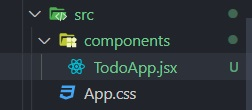

```jsx
export default function TodoApp() {
  return <div>Hola</div>;
}
```

# App.js es nuestra página principal

Es donde vamos a montar los componentes.  
Importamos el componente Padre TodoApp.jsx.

```jsx
import TodoApp from "./components/TodoApp";

function App() {
  return <TodoApp />;
}

export default App;
```

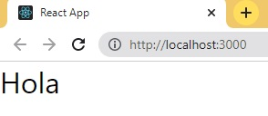

# Añadimos estilo mediante className

En este caso en vez de utilizar la palabra _class_ utilizamos **className** que utiliza el formato camelCase.  
Por lo tanto es buena práctica mantener el nombre de los estilos con ese formato (todoContainer).

```jsx
export default function TodoApp() {
  return <div className="todoContainer"></div>;
}
```

# Dentro del componente creamos un formulario

```jsx
export default function TodoApp() {
  return (
    <div className="todoContainer">
      <form className="todoCreateForm">
        <input className="todoInput" />
        <input type="submit" value="Create todo" className="buttonCreate" />
      </form>
    </div>
  );
}
```

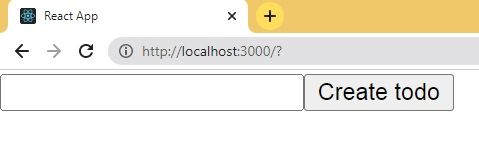

# Hooks: useState

Un Hooks es una **función** que nos va a permitir actualizar información de nuestro estado (variables) de la aplicación. Para cuando suceda algun evento React pueda actualizar automaticamente esa información y pueda cambiar la interfaz a los valores asignados.  
Importamos el useState() para poder usarlo.  
**useState**: Nos permite definir un etado inicial para después manipularlo.  
Nos regresa un arreglo de dos elementos, para ello vamos a desestructurar un arreglo.  
title es como un get, regresa el valor de ese estado. Es el estado que queremos obtener.
Y el segundo parámetro (setTitle) es una función que me permite cambiar el valor de mi estado. Es el estado que queremos cambiar.
Y por último llamamos a **useState()**.  
useStete() me permite especificar un valor inicial a mi estado. Como es de tipo string solo coloco comillas "". Esto es un string vacio inicialmente.

```jsx
import { useState } from "react";

export default function TodoApp() {
  const [title, setTitle] = useState("");
  return (
    <div className="todoContainer">
      <form className="todoCreateForm">
        <input className="todoInput" />
        <input type="submit" value="Create todo" className="buttonCreate" />
      </form>
    </div>
  );
}
```

# Si quiero imprimir la variable

LLaves y dentro la variable inicial title, en este caso se inicia con la palabra Hola.
Estoy imprimiendo el estado inicial (la variable inicial de nombre title)

```jsx
import { useState } from "react";

export default function TodoApp() {
  const [title, setTitle] = useState("Hola");
  return (
    <div className="todoContainer">
      <form className="todoCreateForm">
        <input className="todoInput" />
        <input type="submit" value="Create todo" className="buttonCreate" />
        {title}
      </form>
    </div>
  );
}
```

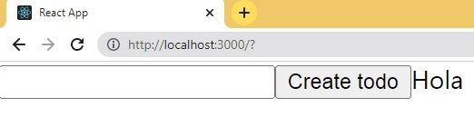

Ahora voy a mostrar ese valor dentro del input.

```jsx
import { useState } from "react";

export default function TodoApp() {
  const [title, setTitle] = useState("Hola");
  return (
    <div className="todoContainer">
      <form className="todoCreateForm">
        <input className="todoInput" value={title} />
        <input type="submit" value="Create todo" className="buttonCreate" />
        {title}
      </form>
    </div>
  );
}
```

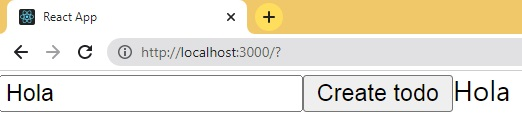

# Cambio de estado

Para cambiar el estado le vamos asignar un **evento** a nuestro botón.  
Le asignamos una función flecha, en este caso inline.  
Esta regresa una varieble **event**.

```jsx
import { useState } from "react";

export default function TodoApp() {
  const [title, setTitle] = useState("Hola");
  return (
    <div className="todoContainer">
      <form className="todoCreateForm">
        <input className="todoInput" value={title} />
        <input
          onClick={(e) => setTitle("Fernando")}
          type="submit"
          value="Create todo"
          className="buttonCreate"
        />
        {title}
      </form>
    </div>
  );
}
```

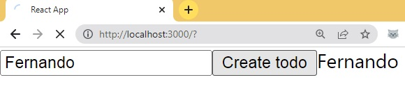  
Cambia pero luego se actualiza la aplicación


# En caso de que la funcion tenga mas de 1 linea

Se suele escribir la función dentro del componente.
En este caso delego la function a handleClick.
Como estoy mandando a llamar un formulario a traves de un input de tipo submit, trata de enviarse ese formulario por eso es que se actualiza la aplicación.  
Si escrivo e.preventDefault() anulo el comportamiento nativo de ese input.

```jsx
import { useState } from "react";

export default function TodoApp() {
  const [title, setTitle] = useState("Hola");

  function handleClick(e) {
    e.preventDefault();
    setTitle("Fernando");
  }

  return (
    <div className="todoContainer">
      <form className="todoCreateForm">
        <input className="todoInput" value={title} />
        <input
          onClick={handleClick}
          type="submit"
          value="Create todo"
          className="buttonCreate"
        />
        {title}
      </form>
    </div>
  );
}
```

Al hacer click se actualiza la applicación.
  
Ahora lo que necesito es que cada vez que escriba en mi input se vaya actualizando mi estado.
Entonces para estar atento a los cambios dentro del input voy a implementar un evento de tipo **onChange**.  
Como puedo obtener el valor de mi input mientras escribo?  
Hago uso de la propiedad value del evento a traves de target y luego mando a llamar a setTitle y le paso la variable value.
Entonces cada vez que escriba dentro del input estoy actualizando el estado.

```jsx
import { useState } from "react";

export default function TodoApp() {
  const [title, setTitle] = useState("Hola");

  function handleClick(e) {
    e.preventDefault();
    setTitle("Fernando");
  }

  function handleChange(event) {
    const value = event.target.value;

    setTitle(value);
  }

  return (
    <div className="todoContainer">
      <form className="todoCreateForm">
        <input onChange={handleChange} className="todoInput" value={title} />
        <input
          onClick={handleClick}
          type="submit"
          value="Create todo"
          className="buttonCreate"
        />
        {title}
      </form>
    </div>
  );
}
```

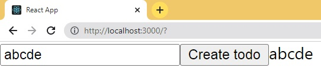  
Ahora necesito definir otro estado para ir guardando en una lista de tareas todos mis tareas.
Todas mis tareas las voy a guardar dentro de un arreglo.
En este caso es el formulario el que esta escuchando el evento.
Dentro de la function handleSubmit() creamos el arreglo con algunas propiedades. Generamos una ID aleatorio utilizando la API de crypto.  
Un title haciendo referencia a title accediendo al estado ya que todas las funciones que esten dentro de TodoApp tiene acceso a utilizar las variables de estado.
Y un atributo mas completed.
En react para modificar un estado tenemos que establecerlo a traves del set. Entonces hay que mandar a llamar a setTodos pasando el nuevo valor.
Creamos una variable temp y copiamos nuestro arreglo ...todos y luego insertamos al inicio del arreglo (unshift()) la nueva tarea.
Y luego actualizamos setTodo con la variable temp.

```jsx
import { useState } from "react";

export default function TodoApp() {
  const [title, setTitle] = useState("Hola");
  const [todos, setTodos] = useState([]);

  function handleClick(e) {
    e.preventDefault();
    setTitle("Fernando");
  }

  function handleChange(event) {
    const value = event.target.value;
    setTitle(value);
  }

  function handleSubmit(e) {
    e.preventDefault();

    const newTodo = {
      id: crypto.randomUUID(),
      title: title,
      completed: false,
    };

    const temp = [...todos];
    temp.unshift(newTodo);

    setTodos(temp);
  }

  return (
    <div className="todoContainer">
      <form className="todoCreateForm" onSubmit={handleSubmit}>
        <input onChange={handleChange} className="todoInput" value={title} />
        <input
          onClick={handleClick}
          type="submit"
          value="Create todo"
          className="buttonCreate"
        />
      </form>
    </div>
  );
}
```

Ahora cuando hago click en el boton Create todo en vez de ir a llamar a la funcion handleClick la cambio por handleSubmit ya que es el mismo comportamiento.

```jsx
import { useState } from "react";

export default function TodoApp() {
  const [title, setTitle] = useState("Hola");
  const [todos, setTodos] = useState([]);

  function handleChange(event) {
    const value = event.target.value;
    setTitle(value);
  }

  function handleSubmit(e) {
    e.preventDefault();

    const newTodo = {
      id: crypto.randomUUID(),
      title: title,
      completed: false,
    };

    const temp = [...todos];
    temp.unshift(newTodo);

    setTodos(temp);
  }

  return (
    <div className="todoContainer">
      <form className="todoCreateForm" onSubmit={handleSubmit}>
        <input onChange={handleChange} className="todoInput" value={title} />
        <input
          onClick={handleSubmit}
          type="submit"
          value="Create todo"
          className="buttonCreate"
        />
      </form>
      <div className="todoContainer">
        {todos.map((item) => (
          <div key={item.id}>{item.title}</div>
        ))}
      </div>
    </div>
  );
}
```

Renderiza en tiempo real

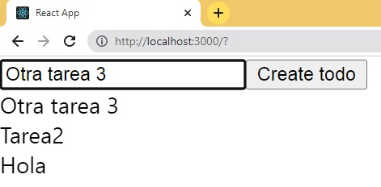

# Creamos otro nuevo componente Todo.jsx

```jsx
export default function Todo(props) {
  return <div>{props.item.title}</div>;
}
```

Desestructuramos, de esta manera evitamos los props y vamos directamente con la propiedad.

```jsx
export default function Todo({ item }) {
  return <div>{item.title}</div>;
}
```

Ahora vamos a usar el componente.  
Lo vamos a utilizar y va a reemplazar en TodoApp.jsx a la linea

```jsx
<div key={item.id}>{item.title}</div>
```

TodoApp.jsx

```jsx
import { useState } from "react";
import Todo from "./Todo";

export default function TodoApp() {
  const [title, setTitle] = useState("Hola");
  const [todos, setTodos] = useState([]);

  function handleChange(event) {
    const value = event.target.value;
    setTitle(value);
  }

  function handleSubmit(e) {
    e.preventDefault();

    const newTodo = {
      id: crypto.randomUUID(),
      title: title,
      completed: false,
    };

    const temp = [...todos];
    temp.unshift(newTodo);

    setTodos(temp);
  }

  return (
    <div className="todoContainer">
      <form className="todoCreateForm" onSubmit={handleSubmit}>
        <input onChange={handleChange} className="todoInput" value={title} />
        <input
          onClick={handleSubmit}
          type="submit"
          value="Create todo"
          className="buttonCreate"
        />
      </form>
      <div className="todoContainer">
        {todos.map((item) => (
          <Todo key={item.id} item={item} />
        ))}
      </div>
    </div>
  );
}
```

Todo lo relacionado a un **todo** va a estar en Todo.jsx

# Botón Editar y botón Delete

Voy a crear un botón en el componente Todo.jsx para editar y otro para eliminar.

```jsx
export default function Todo({ item }) {
  return (
    <div>
      {item.title}
      <button>Edit</button>
      <button>Delete</button>
    </div>
  );
}
```

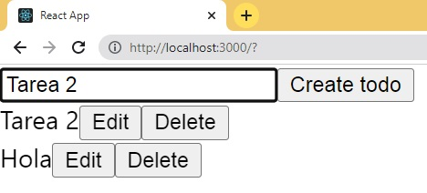

# ¿Como implementamos la funcionalidad de los botones Edit y Delete?

Para ello vamos a crear un nuevo estado.  
Importo el useState.
Agrego el evento onClick.  
Cuando este en true quiero que me permita editar.
Entonces 1ro voy a crear una capa-estructura.
Utilizo un operador ternario.

```jsx
import { useState } from "react";

export default function Todo({ item }) {
  const [isEdit, setIsEdit] = useState(false);
  return (
    <>
      <div className="todo">
        {isEdit ? (
          <div>Modo editar</div>
        ) : (
          <div>
            {item.title}
            <button onClick={() => setIsEdit(true)}>Edit</button>
            <button>Delete</button>
          </div>
        )}
      </div>
    </>
  );
}
```

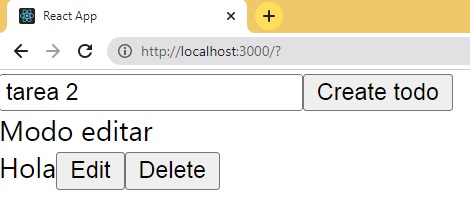  
Ahora vamos a crear un componente FormEdit y lo pondremos dentro de otro componente.

# FormEdit

Le ponemos un input de tipo text.
Y un botón para Actualizar la tarea.

# TodoElement

Creamos otro componente que se llame TodoElement.
Aqui copiamos donde tengo el titulo y los botones.

```jsx
import { useState } from "react";

export default function Todo({ item }) {
  const [isEdit, setIsEdit] = useState(false);

  function FormEdit() {
    return (
      <form>
        <input type="text" />
        <button>Update</button>
      </form>
    );
  }

  function TodoElement() {
    return (
      <div className="todoInfo">
        {item.title}
        <button onClick={() => setIsEdit(true)}>Edit</button>
        <button>Delete</button>
      </div>
    );
  }

  return (
    <>
      <div className="todo">{isEdit ? <FormEdit /> : <TodoElement />}</div>
    </>
  );
}
```

Al FormEdit le agrego un evento de tipo onSubmit y un onChange.
Creamos el estado por que no existe.
Entonces cuando cambie el texto actualizamos el estado.

```jsx
import { useState } from "react";

export default function Todo({ item }) {
  const [isEdit, setIsEdit] = useState(false);

  function FormEdit() {
    const [newValue, setNewValue] = useState(item.title);
    function handleSubmit(e) {
      e.preventDefault();
    }

    function handleChange(e) {
      const value = e.target.value;
      setNewValue(value);
    }

    return (
      <form className="todoUpdateForm" onSubmit={handleSubmit}>
        <input
          type="text"
          className="todoInput"
          onChange={handleChange}
          value={newValue}
        />
        <button>Update</button>
      </form>
    );
  }

  function TodoElement() {
    return (
      <div className="todoInfo">
        {item.title}
        <button onClick={() => setIsEdit(true)}>Edit</button>
        <button>Delete</button>
      </div>
    );
  }

  return (
    <>
      <div className="todo">{isEdit ? <FormEdit /> : <TodoElement />}</div>
    </>
  );
}
```

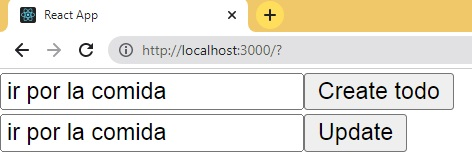
Ahora cuando hago click en update deveria actualizar.
Hay que mandar a llamar a una funcion que nosotros la pasamos por props (onUpdate).
Le paso el itemis y el newValue.
Y despúes tengo que pasar setIsEdit como false.
```jsx
import { useState } from "react";

export default function Todo({ item, onUpdate }) {
  const [isEdit, setIsEdit] = useState(false);

  function FormEdit() {
    const [newValue, setNewValue] = useState(item.title);
    function handleSubmit(e) {
      e.preventDefault();
    }

    function handleChange(e) {
      const value = e.target.value;
      setNewValue(value);
    }

    function handleClickUpdateTodo() {
        onUpdate(item.id, newValue);
        setIsEdit(false);
    }

    return (
      <form className="todoUpdateForm" onSubmit={handleSubmit}>
        <input
          type="text"
          className="todoInput"
          onChange={handleChange}
          value={newValue}
        />
        <button className="button" onClick={handleClickUpdateTodo} >Update</button>
      </form>
    );
  }

  function TodoElement() {
    return (
      <div className="todoInfo">
        {item.title}
        <button onClick={() => setIsEdit(true)}>Edit</button>
        <button>Delete</button>
      </div>
    );
  }

  return (
    <>
      <div className="todo">{isEdit ? <FormEdit /> : <TodoElement />}</div>
    </>
  );
}

```
# En TodoApp.jsx
Tengo que actualizar el evento onUpdate que es igual a un onClick.
```jsx
import { useState } from "react";
import Todo from "./Todo";

export default function TodoApp() {
  const [title, setTitle] = useState("Hola");
  const [todos, setTodos] = useState([]);

  function handleChange(event) {
    const value = event.target.value;
    setTitle(value);
  }

  function handleSubmit(e) {
    e.preventDefault();

    const newTodo = {
        id: crypto.randomUUID(),
        title: title,
        completed: false
    }

    const temp = [...todos];
    temp.unshift(newTodo);

    setTodos(temp);
  }

  function handleUpdate(id, value) {
    const temp = [...todos];
    const item = temp.find(item => item.id === id);
    item.title = value;
    setTodos(temp);
  }

  return (
    <div className="todoContainer">
      <form className="todoCreateForm" onSubmit={handleSubmit}>
        <input onChange={handleChange} className="todoInput" value={title} />
        <input
          onClick={handleSubmit}
          type="submit"
          value="Create todo"
          className="buttonCreate"
        />
      </form>
      <div className="todoContainer">
        {todos.map((item) => (
          <Todo key={item.id} item={item} onUpdate={handleUpdate} />
        ))}
      </div>
    </div>
  );
}

```
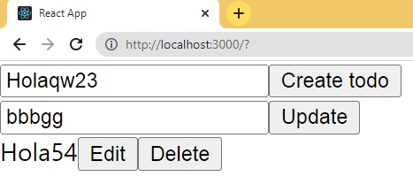
# Botón Delete
Agrego el evento y mando a llamar a otra funcion. Mando a llamar a la funcion como props.
```jsx
import { useState } from "react";

export default function Todo({ item, onUpdate, onDelete }) {
  const [isEdit, setIsEdit] = useState(false);

  function FormEdit() {
    const [newValue, setNewValue] = useState(item.title);
    function handleSubmit(e) {
      e.preventDefault();
    }

    function handleChange(e) {
      const value = e.target.value;
      setNewValue(value);
    }

    function handleClickUpdateTodo() {
        onUpdate(item.id, newValue);
        setIsEdit(false);
    }

    return (
      <form className="todoUpdateForm" onSubmit={handleSubmit}>
        <input
          type="text"
          className="todoInput"
          onChange={handleChange}
          value={newValue}
        />
        <button className="button" onClick={handleClickUpdateTodo} >Update</button>
      </form>
    );
  }

  function TodoElement() {
    return (
      <div className="todoInfo">
        {item.title}
        <button onClick={() => setIsEdit(true)}>Edit</button>
        <button onClick={(e) => onDelete(item.id)}>Delete</button>
      </div>
    );
  }

  return (
    <>
      <div className="todo">{isEdit ? <FormEdit /> : <TodoElement />}</div>
    </>
  );
}
```  
En TodoApp.jsx implemento la propiedad onDelete
```jsx
import { useState } from "react";
import Todo from "./Todo";

export default function TodoApp() {
  const [title, setTitle] = useState("Hola");
  const [todos, setTodos] = useState([]);

  function handleChange(event) {
    const value = event.target.value;
    setTitle(value);
  }

  function handleSubmit(e) {
    e.preventDefault();

    const newTodo = {
      id: crypto.randomUUID(),
      title: title,
      completed: false,
    };

    const temp = [...todos];
    temp.unshift(newTodo);

    setTodos(temp);
  }

  function handleUpdate(id, value) {
    const temp = [...todos];
    const item = temp.find((item) => item.id === id);
    item.title = value;
    setTodos(temp);
  }

  function handleDelete(id) {
    const temp = todos.filter((item) => item.id !== id);
    setTodos(temp);
  }

  return (
    <div className="todoContainer">
      <form className="todoCreateForm" onSubmit={handleSubmit}>
        <input onChange={handleChange} className="todoInput" value={title} />
        <input
          onClick={handleSubmit}
          type="submit"
          value="Create todo"
          className="buttonCreate"
        />
      </form>
      <div className="todoContainer">
        {todos.map((item) => (
          <Todo
            key={item.id}
            item={item}
            onUpdate={handleUpdate}
            onDelete={handleDelete}
          />
        ))}
      </div>
    </div>
  );
}
```
Limpio el input con el boton Create todo
```jsx
function handleSubmit(e) {
    e.preventDefault();

    const newTodo = {
      id: crypto.randomUUID(),
      title: title,
      completed: false,
    };

    const temp = [...todos];
    temp.unshift(newTodo);

    setTodos(temp);

    setTitle("");
  }
```
# Estilos TodoApp.css
Aquí definimos todos los estilos.
```jsx
import './todoApp.css';
```